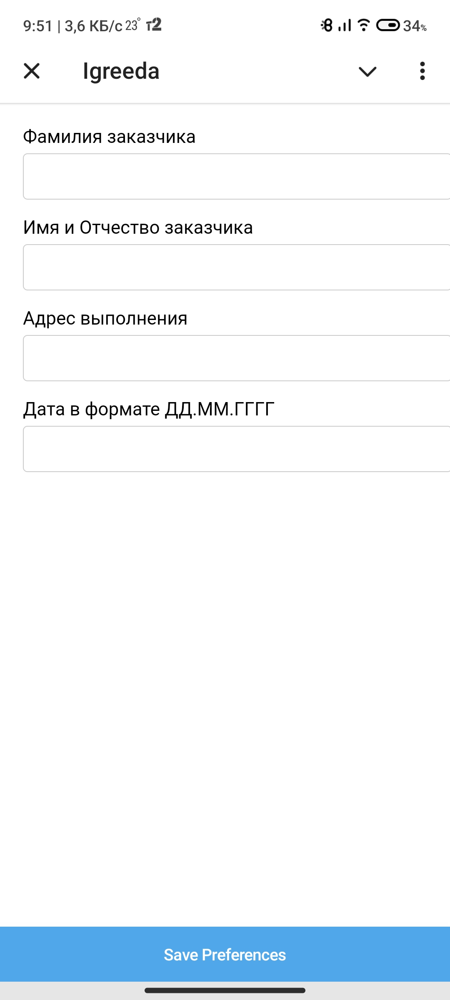

# TG Бот для СТВ с Web-App Формой

летом 2024 года я работал в компании СТВ. В рамках работы я получил тз сделать WEB-хранилище для монтажей. На момент начала работы, все монтажи хранились в ТГ-чате, заполнение было по определенной форме, которую каждый монтажник должен был редактировать вручную. В рамках работы я создал замену существующей формы, которую просто копировали и заполняли, на более удобную и визуализированную Web-App Форму с автоматическим формированием и автоматической отправкой отчетов в ТГ-бота, Группу и на Web-хранилище, разработанное мной.

## Я сделал
- [Web-хранилище](https://github.com/Igggor/STV_Storage) с возможностью добавлять и просматривать данные в нем.
- API-функции в этом хранилище для добавления и получения данных.
- ТГ-бот с Web-App формой, для привычного заполнения форм. Данные из этой формы отправляются посредством метода API на WEB-сервер(хранилище).
- 

## Screenshots

Форма в белой теме

Форма в темной теме

Заполненная форма

Форма отправлена

Отправленные медиа

Финальный отчет в чате Телеграмма

## Tech Stack

**BOT:** Python 3.x, telegram-bot-api, env-file

**Sharing data:** requests, django, API-method, JSON

**Web-App form:** Html, CSS, JS, BootStrap

## Дорожная карта

- Создание бота, способного открывать Web-App форму

- Создание Web-App формы, способной получать данные у пользователя и возвращать из в ТГ-бота

- Написание функционала бота, а именно получение данных из Web-App формы, запрос медиа-файлов у пользователя (фото и видео), отправка данных на сервер посредством API.
## Environment Variables

Чтобы запустить проект, Вам необходимо добавить некоторые переменные в Ваш .env файл

`BOT_TOKEN` - Токен Вашего Телеграмм бота, можно получить у BotFather

`BOT_USERNAME` - Имя вашего бота, ссылка на него

`TARGET_CHAT_ID` - ID чата, куда будут пересылаться отчеты

`DJANGO_URL` - Ссылка на Ваш API-сервис, куда будут отправляться новые данные об отчетах
## Фичи от меня

+ Стили Web-App Формы отличаются, в зависимости от темы пользователя в телеграмме. Это сделано при помощи JS, при открытии Формы происходит получение текущей темы пользователя, в завсисимости от этого форме придаются определенные стили. Так же, событие смены темы ловится обработчиком событий. Тема Web-App формы меняется автоматически (JS)

+ Группировка медиа. При отправке нескольких Медиа-файлов (Фото и видео для отчета), эти файлы группируются в медиагруппы по 10 штук в форме (максимальное количество, разрешенное в Телеграмме). Если Медиа-данных больше 10, то таких групп будет несколько.

## Использование результата

Этот проект активно используется компанией СТВ, а именно:

- Монтажниками, при заполнении формы и отправке отчетов о проделанной работе
- Дизайнерами, при проверке выполненной Монтажниками работы
- Управлением фирмы для контроля и заполнении отчетов в письменном виде.

## Feedback

Если Вы хотите дать обратную связь, ищете меня в Телеграмм 

[Ссылка на мой тг](https://t.me/IgreedaIT)

