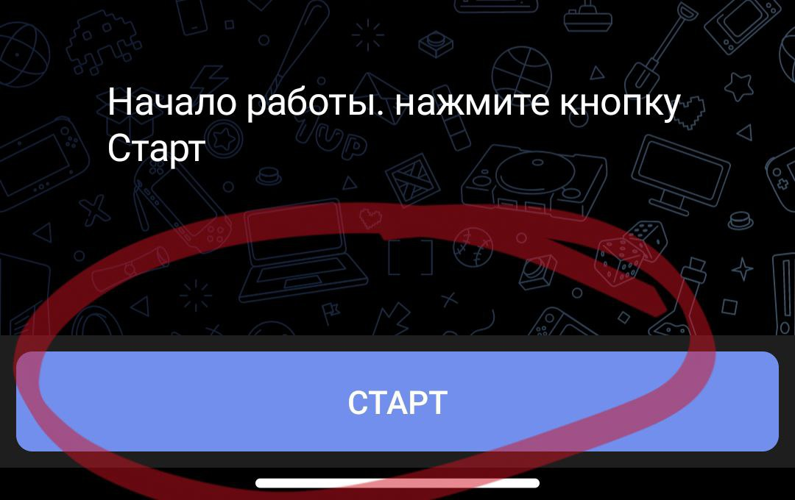
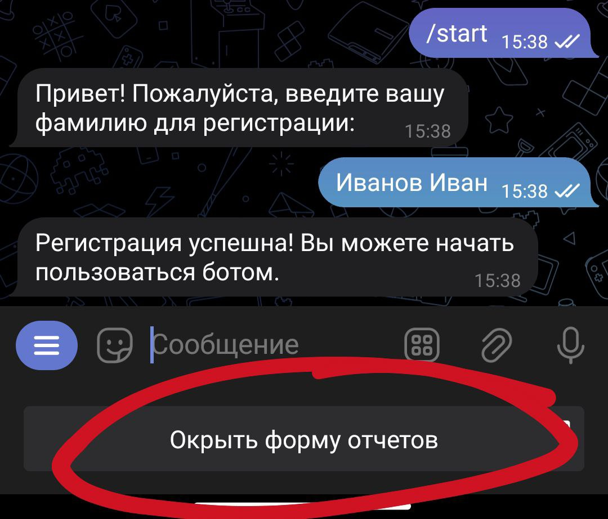
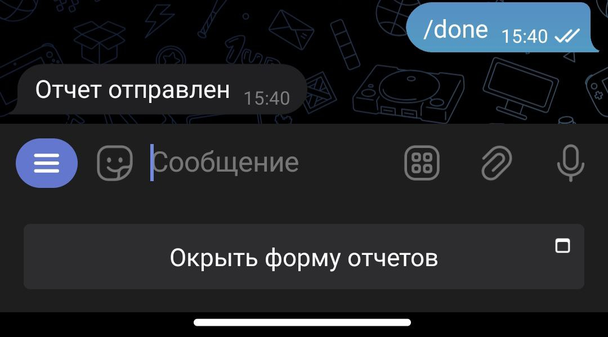
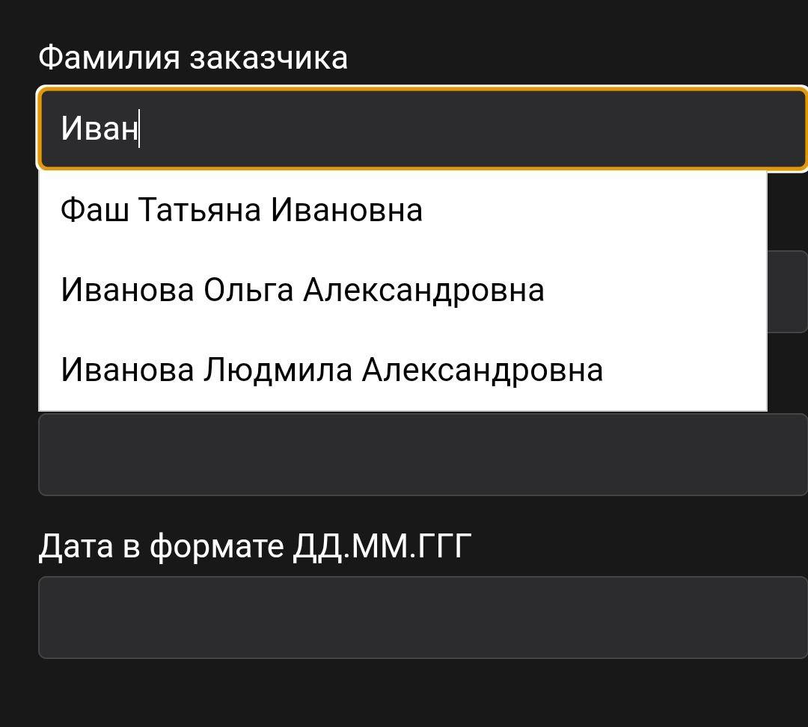
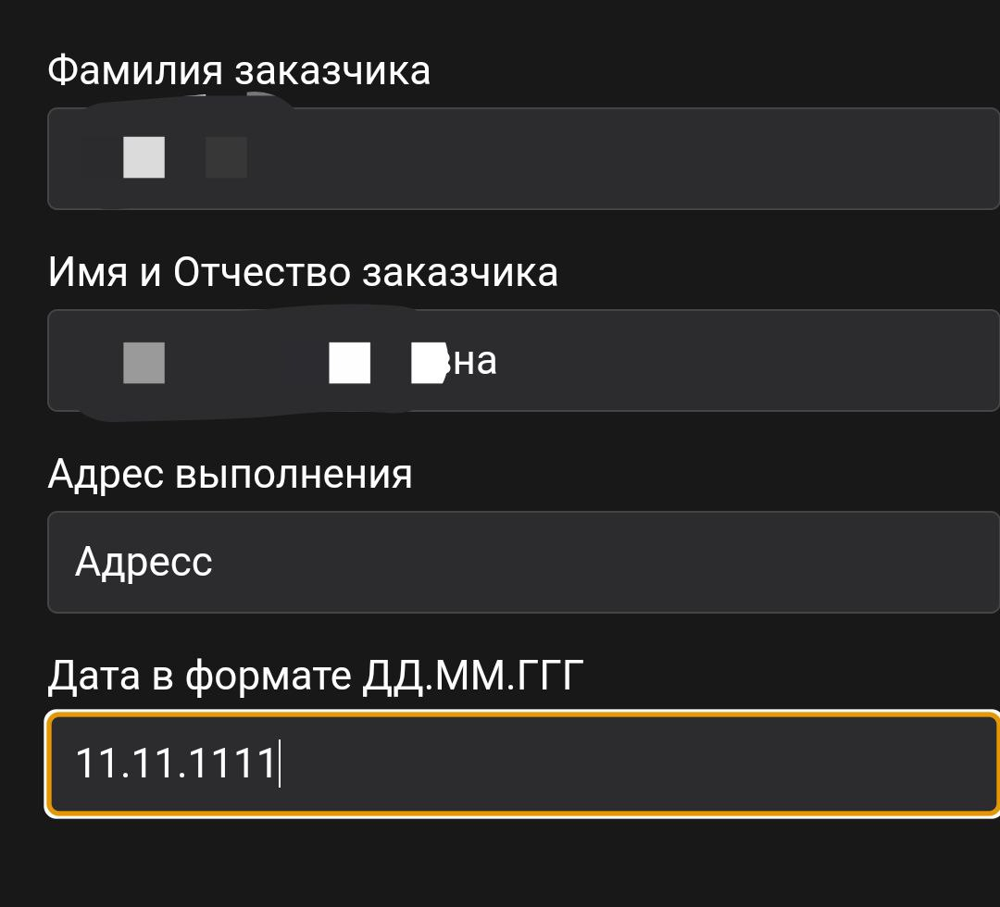
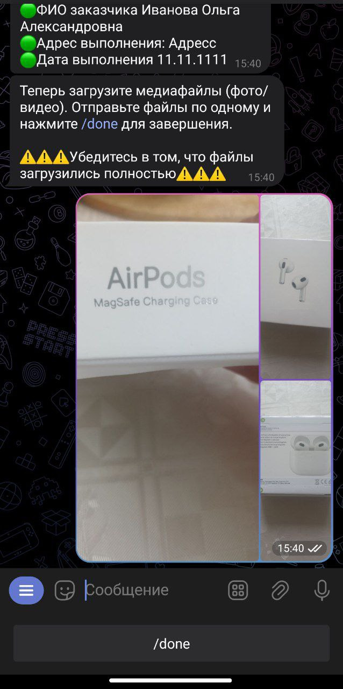

# Новый бот для отчетов

Новый бот для создания отчетов.

## Навигация

 - [Техническая документация](https://github.com/Igggor/STV_Sender_Bot/blob/main/README.md)
 - [Код проекта](https://github.com/Igggor/STV_Sender_Bot/blob/main)
 - [Контакт с автором](https://t.me/ii_nikolaev)


## Использование

1) Первым делом пройдите регистрацию в боте. Это можно сделать при помощи команды ```/start```



2) После ввода команды Вы можете заполнить отчет по кнопке ниже.


 
 Если она отсутствует, можете введите команду ```/start``` или в меню (кнопка слева) выберете команды ```Старт```


3) Заполните отчет в форме. При вводе фамилии будет предложено выбрать существующего заказчика. Предпочтительно выбрать его из выпадающего списка и нажать на него. Фамилия Имя и Отчество заполнятся автоматически.



После этого введите адрес и дату выполнения монтажа. Дату желательно вводить в формате дд.мм.ГГГГ (Например ```22.11.2004```)



После ввода всех данных нажмите на кнопку внизу, после чего письменная часть отчета будет автоматически сформирована и подготовлена к отправке.


4) После заполнения отчета в форме Вам будет предложено прикрепить фото и видео. Для прикрепления медиафайлов к отчету просто отправьте эти файлы боту. 


Будьте вимательны, фото и видео должны загрузиться полностью, иначе при неполной загрузке они будут проигнорированы ботом.

5) После завершения прикрепления фото вы можете нажать на кнопку ниже (```/done```) или ввести команду ```/done``` вручную, чтобы закончить оформление отчета и отправить его.



6) Вам будет предложено заполнить новый отчет. Заполненный отчет был отправлен
## Обратная связь

Если у вас есть какие-то вопросы или обратная связь, то пишите в телеграмм [Мой телеграмм](https://t.me/ii_nikolaev)


## Авторы

- [@igreeda](https://t.me/ii_nikolaev)

